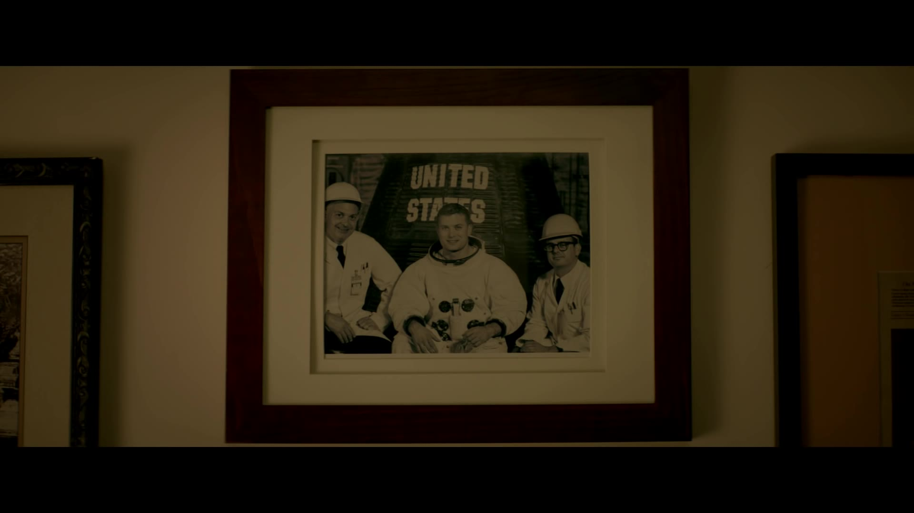
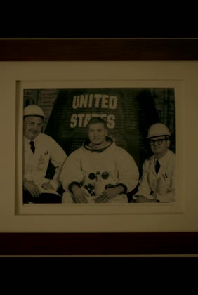

# Scale-CropVideoCover
- base on FFMPEG
- Specific steps:
    - 1.extract cover image from video;
    - 2.scale image to appropriate size;
    - 3.finally,crop it to final size.
 ## Actual effect
    - 1.video name:r8.mp4 size:1920*1080
        - original cover image(1920*1080):
            
        - final cover image(282*420):
            
     - 2.video name:douyin.mp4 size:368*640
        - original cover image(368*640):
            NULL
        - final cover image(282*420):
            
  ## Make
    - Modify the Makefile as needed
    - Execute the 'make' command
